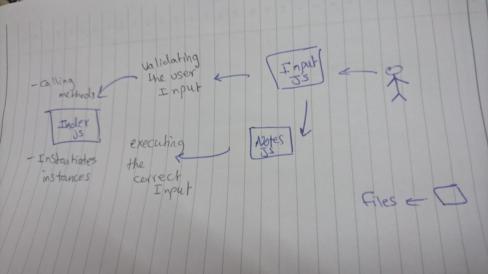

# LAB - Class 01

## Project: Notesy

### Author: Anolla Haddad

### Links and Resources

- [submission PR](https://github.com/401-advanced-javascript-Anolla/notes-app/pull/2)

#### How to initialize/run your application (where applicable)

- `node index.js --add "your note goes here" OR node index.js -a "your note goes here" OR node index.js"`

#### UML

